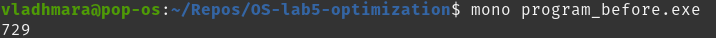

# OS-lab5-optimization

Firstly, we add code to measure time
```
var watch = System.Diagnostics.Stopwatch.StartNew();

...

watch.Stop();
var elapsedMs = watch.ElapsedMilliseconds;
System.Console.WriteLine(elapsedMs);


```

Then, we will measure working time of initial program:


The problem with using memory is in this part:

```
a[j,i]++;
```

We should change it to this:
```
a[i,j]++;
```


